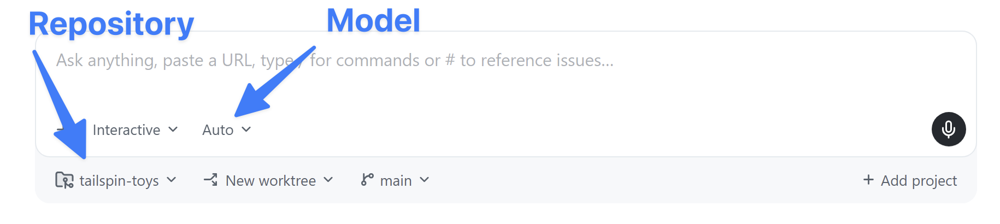

In the previous lesson you toured the workspace and used a quick chat. Now it's time to start an **agent session** and make your first change to the project. You'll keep it small: the games already have a star rating in their data, but the game cards on the home page don't show it yet. You'll ask the agent to surface it, review the change, and merge it as your first pull request.

In this lesson, you will:

- start an agent session and learn how a session is structured.
- ask the agent to make a small, focused change to the project.
- review the change in the workspace diff view.
- run the app locally to confirm the change in the browser.
- open and merge your first pull request.

## Scenario

Each game in Tailspin Toys can have a star rating, and it already appears on the game details page. The game cards on the home page, though, only show the title, category, publisher, and description. As a warm-up, you'll have the agent display the existing rating on each card — a tiny, self-contained change that's perfect for your first session.

## Anatomy of a session

A **session** is a conversation with an agent that runs in its own isolated workspace. Every session gets a **dedicated git worktree and branch**, which is what lets you run several sessions at once — one adding a feature, another fixing a bug — without their changes colliding. Your sessions appear in the sidebar grouped by repository; select any one to switch to it.

Inside a session you'll see three things: the **conversation** with the agent, the agent's **tool activity** as it explores and edits files, and the list of **changed files** with their diffs.

## Start a session and request our change

Let's start a new session to begin exploring the project and implementing our feature. In a [prior lesson][prior-lesson] you added your project from its GitHub repository. We'll create a new session for that repository and request our change.

1. Return to (or open) the GitHub Copilot app.
2. Select the **Home screen**.
3. Ensure `tailspin-toys` is selected for the repo.

   

4. Use the following prompt to request the change:

   ```plaintext
   On the game cards, show each game's star rating. The Game type already includes a starRating field — it's a number out of 5, or null when a game hasn't been rated yet. Display it on each card in src/components/GameCard.astro, and when starRating is null show "No rating yet" instead. Keep the change small and don't restructure the card layout.
   ```

> [!NOTE]
> Notice how the prompt contained the name of the file for Copilot to update. While it's not required at all to specify which files Copilot should include in its work, pointing it in the right direction both helps Copilot quickly generate code and reduce token usage.

5. Select <kbd>Enter</kbd> to send the prompt to Copilot.

Copilot app begins work by first creating a new worktree, an isolated copy of the project. It then explores the project, locating the necessary files to update to add the new feature. It will then create the necessary code. You've now added a new feature with Copilot app!

## Review the diff

All AI-generated changes deserve a review before they're merged, even small ones. Let's explore the changes, right here in Copilot app.

1. In the upper right-hand corner of the app, select **Toggle review panel**. This will open the diff screen with all the outstanding changes made by Copilot.

   

2. You should notice code added to `GameCard.astro`, the core file used to display game details. It should be similar to the following — a small block that renders the rating when present and falls back to "No rating yet" when `starRating` is `null`:

   ```astro
   {game.starRating !== null ? (
       <span class="text-xs font-medium px-2.5 py-0.5 rounded bg-amber-900/60 text-amber-300" data-testid="game-rating">
           ★ {game.starRating} / 5
       </span>
   ) : (
       <span class="text-xs font-medium text-slate-500" data-testid="game-rating-empty">
           No rating yet
       </span>
   )}
   ```

> [!NOTE]
> Because Copilot, like all generative AI tools, is probabilistic rather than deterministic, the exact code may vary from the above. But it should be relatively similar.

## Check the changes

Of course we shouldn't just read the code and assume it works. We should visually test everything as well! To do so we'll need to start the app from the terminal, then confirm everything works. Fortunately there's a terminal built into Copilot app!

1. In the review panel on the right side of Copilot app, select **Terminal**. If there is no **Terminal** button, select the **+** (labeled as **Open in panel**), then select **Terminal**.

   

2. Enter the following command in the terminal window to start the web app's dev server:

   ```shell
   npm run dev
   ```

3. Once the server starts (this will just take a moment), open a browser window.
4. Navigate to http://localhost:4321.
5. You should now see star ratings on all the games on the landing page!
6. Return to the terminal window.
7. Select <kbd>Ctrl</kbd>+<kbd>C</kbd> to stop the dev server.

## Open and merge your first pull request

Your change looks good — now it's time to ship it! You'll ask the agent to open a pull request, then review and merge it yourself on github.com. For now we'll manage this manually. In an upcoming lesson we'll explore how Copilot can handle some of the work for you automatically.

1. In the upper right hand corner, select **Create PR**.
2. If prompted, select **Sign in with your browser** and follow the prompts to authenticate.
3. Copilot gets to work on creating the PR.

Once the PR is created, Copilot will monitor any workflows on the repository that need to run. After a few moments, the button in the upper right will change to **Ready to merge**. This will be your indication your PR is ready to merge!

4. Select the **PR** bubble just above chat to open your PR in the review pane to see your pull request. You can review the PR as needed here.
5. Once ready, select **Ready to merge**.
6. Select **Merge pull request** on the new dialog window to merge your pull request!

You've now pushed a new feature to the website!

## Summary and next steps

You've started your first agent session and shipped your first change! Specifically, you:

- started an agent session and learned how sessions are structured.
- directed the agent to make a small, focused change to the game cards.
- reviewed the change in the workspace diff view.
- ran the app locally to confirm the star rating in the browser.
- opened a pull request and merged it yourself on github.com.

Next, you'll use the app to add a custom instructions standard to the repository — starting from one of the issues in your backlog. Continue to [Lesson 3 - Guiding Copilot with custom instructions][next-lesson].

## Resources

- [Working with agent sessions in the GitHub Copilot app][agent-sessions]
- [About the GitHub Copilot app][about-copilot-app]
- [Managing issues and pull requests with the GitHub Copilot app][managing-issues-prs]

[prior-lesson]: ../1-install-copilot-app/#install-and-configure-the-github-copilot-app
[next-lesson]: ../3-custom-instructions/
[agent-sessions]: https://docs.github.com/copilot/how-tos/github-copilot-app/agent-sessions
[about-copilot-app]: https://docs.github.com/copilot/concepts/agents/github-copilot-app
[managing-issues-prs]: https://docs.github.com/copilot/how-tos/github-copilot-app/managing-issues-and-pull-requests
