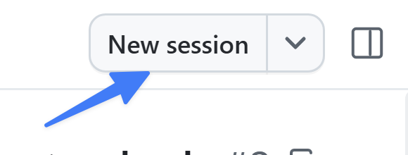
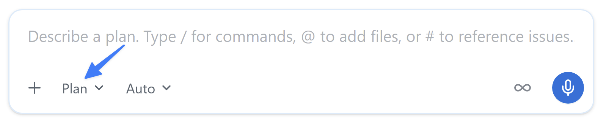
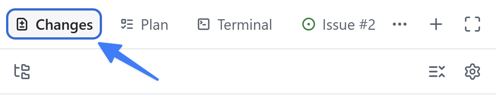
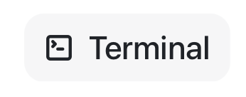
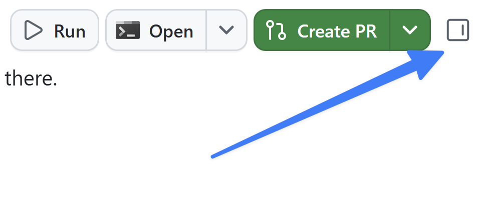

We've made a couple of small updates to our project thus far. But more robust changes require a more robust process. Fortunately, the GitHub Copilot app is built to work with our existing flow, ensuring we build the right things the right way. This is the first of three lessons where you will follow a typical development process, starting by using an issue to generate a new feature and an agent skill to run the validation tests and linters.

In this lesson, you will:

- start a fresh session from the filtering issue.
- use **Plan** mode to plan the feature, then **Autopilot** to build it.
- confirm the generated code follows the documentation standard you merged earlier.
- verify your work with the project's `quality-checks` skill.

## Scenario

The home page lists every game, but visitors can't narrow the list down. The filtering issue asks you to let them filter games by **category** and **publisher**. Let's use Copilot to implement that functionality.

## Background

Introducing AI coding agents to your development flow doesn't change the fundamentals. If anything, they become even more important! Most developers follow a flow that resembles:

1. Open a filed issue with details of what needs to be done.
2. Create a plan of what needs to be built.
3. Build and review the code.
4. Run the tests to validate the code.
5. Manually validate the new functionality.
6. Create a pull request (PR).
7. Once the code has been reviewed and the continuous integration process succeeds, merge the code.

> [!NOTE]
> Depending on your team and organization, the exact specifics will vary. But most will be a variation on the theme listed above.

By sticking to this standard approach you ensure the code generated by AI meets the requirements set forth, and goes through the same vetting process as code written by hand.

## Session modes

The **session mode** controls how much autonomy the agent has. You can set it from the dropdown below the prompt field and change it at any time:

- **Interactive**: You and the agent work together. The agent suggests changes and waits for your input before proceeding.
- **Plan**: The agent creates a plan first. You review and approve the plan before the agent executes it.
- **Autopilot**: The agent works fully autonomously—writing code, running tests, and iterating without waiting for input.

## Plan the filtering feature

The best time to catch a potential issue is before any code is written, and the best way to do that is a bit of planning in advance. By planning with Copilot you'll ask Copilot to generate a set of steps and document the approach it will take. You can then review the plan, make any suggestions you might have to improve it, before letting Copilot generate the code based on the plan.

Let's open the issue, start a new session, and create a plan by switching into plan mode and making the request.

1. Select **My work** from the navigation tab.
2. Select the issue titled **Allow users to filter games by category and publisher**.
3. Select **New session** in the upper right.

   

4. Select <kbd>Shift</kbd>+<kbd>Tab</kbd> until the mode displays **Plan**.

   

5. Send the following prompt. The filtering issue is already in this session's context because you started from it:

   ```plaintext
   Plan the work based on the requirements documented in the issue. Please ask any clarifying questions you might have as you build the plan.
   ```

6. The agent may ask follow-up questions as it builds the plan. Answer them based on how you'd build the feature.

> [!NOTE]
> Because Copilot is probabilistic, the exact follow-up questions Copilot asks will vary. In fact, it might not ask any questions! This is perfectly normal.

7. Once completed, Copilot will offer a plan summary. Review the plan. You should see it propose building queries, adding filter controls, and of course tests. Provide feedback to refine it if you'd like — the agent will incorporate your suggestions into a new version.

## Build it with Autopilot

With the plan created, let's let Copilot build the implementation!

1. In the list of options in the **Plan summary** dialog, select the option closest to **Approve and implement with autopilot**.

Copilot will begin work on the implementation!

> [!NOTE]
> If Copilot doesn't automatically start creating the necessary code, you can prompt it to do so by using a prompt like "Go ahead and start building out the plan!".
>
> Creating the necessary updates will take several minutes. The agent edits and creates files, writes and runs tests, and iterates. Now's a good time to reflect on what you've explored so far, or to enjoy a beverage.

## Review the changes

All AI-generated code needs review before it's merged. Let's both review the code and run the site to ensure everything looks good.

1. Select **Changes** in the upper right to open the code changes.

   

2. Review the changes. You should see new TypeScript and Astro files, and test files. Notice the new helper functions include TSDoc doc comments and a file header comment — the documentation standard you merged in Lesson 3, applied automatically without being asked.
3. In the review panel on the right side of Copilot app, select **Terminal**. If there is no **Terminal** button, select the **+** (labeled as **Open in panel**), then select **Terminal**.

   

4. Enter the following command in the terminal window to start the web app's dev server:

   ```shell
   npm run dev
   ```

5. Once the server starts (this will just take a moment), open a browser window.
6. Navigate to http://localhost:4321.
7. You should now see filters available on the landing page!
8. If anything doesn't look right, you can ask Copilot to make the updates!
9. Once satisfied, return to the terminal window.
10. Select <kbd>Ctrl</kbd>+<kbd>C</kbd> to stop the dev server.

## Verify your work with the quality-checks skill

You could eyeball the diff and call it done, but the team has a defined quality bar — and a repeatable way to check it.

**Agent skills** let you give Copilot guidance on how to perform repeatable tasks like running tests, generating builds, or creating pull requests. A skill is a folder of instructions, scripts, and resources that the agent can load on demand. [Agent Skills is an open standard][agent-skills-repo] used by a range of agents, so the same skill works across Copilot Chat in agent mode, Copilot cloud agent, Copilot CLI, and the GitHub Copilot app.

Skills live in the `.github/skills` folder of a project, or globally in `~/.copilot/skills`. Each skill is a folder containing a `SKILL.md` file with YAML frontmatter (a `name` and a `description`) followed by the markdown instructions:

```yaml
---
name: quality-checks
description: Run the project's test suites and linter to verify code changes are ready to commit, push, or merge.
---
```

Skills can also include subfolders with scripts, assets, and reference material. The full structure is covered in the [agent skills specification][agent-skills-spec].

> [!TIP]
> Skills are loaded dynamically. The agent decides which skill applies based on the `description` field — a clear, scenario-specific description is the difference between a skill that gets used and one that gets ignored.

## Explore the quality-checks skill

Let's explore the skill to see what it does.

1. If the review panel is not already visible, open it by selecting **Toggle review panel** in the upper right.

   

2. Select the **+** to add a new item to the review panel.
3. Select **File**.
4. Search for `SKILL.md`.
5. Select `SKILL.md .github/skills/quality-checks` from the list of files to open it.
6. Note the `name` and `description`. The description tells the agent *when* to use it — whenever code changes need to be tested, linted, or verified before a commit, push, or merge.
7. Read through the skill. Notice it documents which script runs which suite (unit tests, Playwright end-to-end tests, ESLint), in what order, and how to debug common failures — so the agent runs the checks the team's way instead of guessing.

## Run the checks

In the same filtering session, ask the agent to verify the work. You won't name the skill — the agent will match it from your request.

1. Return to Copilot app.
2. Directly call the skill by using the slash command `/quality-checks` and select <kbd>Enter</kbd>.
3. Following the skill, the agent runs the unit tests, the linter, and the end-to-end tests, and reports the results. If anything fails, ask it to fix the issue and run the checks again until everything is green.
4. **Keep this session open.** In the next lesson you'll add the Playwright MCP server and use it to see the filtering feature working in a real browser.

## Summary and next steps

You built a real feature end to end and verified it against the team's bar! Specifically, you:

- started a fresh session from the filtering issue on an up-to-date project.
- used Plan mode to plan the feature and Autopilot to build it.
- confirmed the generated helper followed the documentation standard you merged in Lesson 3.
- verified your work with the `quality-checks` skill.

Next, you'll connect the Playwright MCP server and ask the agent to explore your filtering feature in a real browser. Continue to [Lesson 5 - Testing with the Playwright MCP server][next-lesson].

## Resources

- [Working with agent sessions in the GitHub Copilot app][agent-sessions]
- [About Agent Skills][about-agent-skills]
- [Customizing the GitHub Copilot app][customize-app]
- [About cloud and local sandboxes for GitHub Copilot][sandboxes]

[ex0]: ../0-prerequisites/
[ex2]: ../2-add-star-rating/
[ex3]: ../3-custom-instructions/
[next-lesson]: ../5-mcp-playwright/
[agent-sessions]: https://docs.github.com/copilot/how-tos/github-copilot-app/agent-sessions
[about-agent-skills]: https://docs.github.com/copilot/concepts/agents/about-agent-skills
[customize-app]: https://docs.github.com/copilot/how-tos/github-copilot-app/customize-github-copilot-app
[sandboxes]: https://docs.github.com/copilot/concepts/about-cloud-and-local-sandboxes
[agent-skills-repo]: https://github.com/agentskills/agentskills
[agent-skills-spec]: https://agentskills.io/specification
