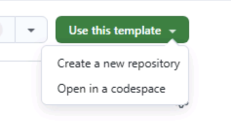

Before you start the Copilot cloud agent exercises, you need to get everything ready. You'll create your own copy of the Tailspin Toys repository and spin up a [codespace][codespaces] you can use to edit instruction files and review the work the cloud agent produces.

## Setting up the lab repository

To create a copy of the repository for the code you'll create, you'll make an instance from the [template][template-repository]. The new instance will contain all of the necessary files for the lab, and you'll use it as you work through the exercises.

1. In a new browser window, navigate to the GitHub repository for this lab: `https://github.com/github-samples/tailspin-toys`.
2. Create your own copy of the repository by selecting the **Use this template** button on the lab repository page. Then select **Create a new repository**.

    

3. If you are completing the workshop as part of an event being led by GitHub or Microsoft, follow the instructions provided by the mentors. Otherwise, you can create the new repository in an organization where you have access to GitHub Copilot.

    

4. Make a note of the repository path you created (**organization-or-user-name/repository-name**), as you will be referring to this later in the lab.
## Creating a codespace

Next up, you'll use a codespace to complete the lab exercises.

[GitHub Codespaces][codespaces] are a cloud-based development environment that allows you to write, run, and debug code directly in your browser. It provides a fully-featured IDE with support for multiple programming languages, extensions, and tools.

1. Navigate to your newly created repository.
2. Select the green **Code** button.

    

3. Select the **Codespaces** tab and select the **+** button to create a new Codespace.

    

The creation of the codespace will take several minutes, although it's still far quicker than having to manually install all the services! That said, you can use this time to explore other features of GitHub Copilot, which we'll turn your attention to next.

> [!CAUTION]
> You'll return to the codespace in a future exercise. For the time being, leave it open in a tab in your browser.

> [!NOTE]
> This workshop is built to run inside a codespace or local [dev container][dev-containers]. Both ensure the environment has all the necessary prerequisites installed for a smooth experience. If you'd prefer to run it locally, open the cloned repository in VS Code and select **Reopen in Container** when prompted — VS Code will build the same dev container the codespace uses.

[codespaces]: https://github.com/features/codespaces
[dev-containers]: https://code.visualstudio.com/docs/devcontainers/containers
## Summary

Congratulations, you have created a copy of the lab repository! You also began the creation process of your codespace, which you'll use as you work alongside the Copilot cloud agent.

## Next step

Let's add custom instructions the cloud agent will follow. Continue to [Exercise 1 - Custom instructions][next-lesson].

## Resources

- [GitHub Codespaces overview][codespaces]
- [Creating a repository from a template][template-repository]
- [Getting started with Codespaces][codespaces-quickstart]

[template-repository]: https://docs.github.com/repositories/creating-and-managing-repositories/creating-a-template-repository
[codespaces-quickstart]: https://docs.github.com/codespaces/getting-started/quickstart
[next-lesson]: ../1-custom-instructions/
