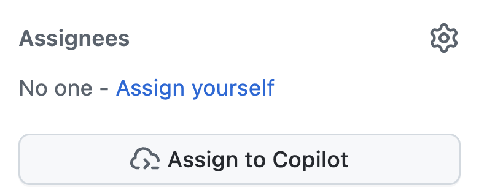
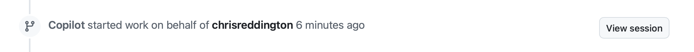
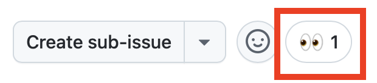

| [← Previous lesson: Custom instructions][previous-lesson] |
|:--|

There are likely very few, if any, organizations who don't struggle with tech debt. This could be unresolved security issues, legacy code requiring updates, or feature requests which have languished on the backlog because there just wasn't the time to implement them. GitHub Copilot's cloud agent is built to perform tasks such as updating code and adding functionality, all in an autonomous fashion. Once the agent completes its work, it generates a draft PR ready for a human developer to review. This allows offloading of tedious tasks and an acceleration of the development process, and frees developers to focus on larger picture items.

You'll explore the following with Copilot cloud agent:

- customizing the environment for generating code.
- ensuring operations are performed securely.
- the importance of clearly scoped issues.
- assigning issues to Copilot.

## Scenarios

Tailspin Toys has some tech debt they'd like to address. The contractors initially hired to create the first version of the site left the documentation in an unideal state - and by that you'll notice it's completely lacking. As a first step, they'd like to see TSDoc doc comments added to all exported functions in the application.

Additionally, the design team is ready to improve game discovery. They'd like each game's details page to show related games — other titles in the same category — so people can keep browsing. They don't need a polished implementation yet; they just want something they can use for acceptance testing of the UX. This is currently a blocker, but there are other issues which are of higher priority at the moment.

These are both examples of tasks which can quickly find themselves deprioritized, and are great to assign to Copilot cloud agent. Copilot cloud agent can then work on them asynchronously, allowing the developer to focus on other tasks, then return to review Copilot's work and ensure everything is as expected.
## Introducing GitHub Copilot cloud agent

[GitHub Copilot cloud agent](https://docs.github.com/copilot/concepts/agents/cloud-agent/about-cloud-agent#overview-of-copilot-cloud-agent-formerly-copilot-coding-agent) can perform tasks in the background, much in the same way a human developer would. And, just like with working with a human developer, this can be done in multiple ways, including [assigning a GitHub issue to Copilot](https://docs.github.com/copilot/how-tos/use-copilot-agents/cloud-agent/start-copilot-sessions). Once assigned, Copilot will create a draft pull request to track its progress, setup an environment, and begin working on the task. You can dig into Copilot's session while it's still in flight or after its completed. Once its ready for you to review the proposed solution, it'll tag you in the pull request!
## The importance of well-scoped instructions

There's no magic in GitHub Copilot — you don't get to skip the thinking. Even seemingly straightforward operations carry complexity once you peel back the layers, so [be mindful about how you scope tasks for Copilot cloud agent][cloud-agent-best-practices]. Treat it like an AI pair programmer: work in stages, learn, experiment, and adapt as you go. The fundamentals of software development don't change with the addition of generative AI.

## Custom instructions in this repository

Earlier exercises introduced custom instructions and how they guide Copilot. If you've already worked through a custom-instructions hands-on you've seen `.github/copilot-instructions.md` in action; if not, this is a good moment to take a quick look. Before assigning work to Copilot cloud agent, take a read-only look at the instruction files already included in this repository so you can spot their effect later.

Open the following files in the GitHub web UI for your repository, or in a codespace if you already have one running:

- `.github/copilot-instructions.md` - Review the **Code standards** section, especially the expectations for TypeScript conventions and TSDoc doc comments.
- `.github/instructions/unit-tests.instructions.md` - Notice the `applyTo` frontmatter, which scopes these instructions to `**/*.test.ts` files.

When you assign the `Code lacks documentation` issue to cloud agent in the next section, watch the resulting pull request for TSDoc doc comments, TypeScript conventions, and comment headers - these come from these instruction files. We'll call this out again when reviewing PRs in a later exercise.

## Setting up the dev environment for the Copilot cloud agent

Creating code, regardless of who's involved, typically requires a specific environment and some setup scripts to be run to ensure everything is in a good state. This holds true when assigning tasks to Copilot, which is performing tasks in a similar fashion to a SWE.

Cloud agent uses [GitHub Actions][github-actions] for its environment when doing its work. You can customize this environment by creating a [special setup workflow][setup-workflow], configured in the `.github/workflows/copilot-setup-steps.yml` file, to run before it gets to work. This enables it to have access to the required development tools and dependencies. This has been pre-configured ahead of the lab to help the lab flow and allow this learning opportunity. It makes sure that Copilot has access to Node.js, project dependencies, browser binaries for end-to-end tests, and the migrated and seeded SQLite database for the single Astro app:

```yaml
name: "Copilot Setup Steps"

# Allows you to test the setup steps from your repository's "Actions" tab
on: workflow_dispatch

env:
  ASTRO_TELEMETRY_DISABLED: "1"

jobs:
  copilot-setup-steps:
    runs-on: ubuntu-latest
    # Set the permissions to the lowest permissions possible needed for *your steps*. Copilot will be given its own token for its operations.
    permissions:
      # If you want to clone the repository as part of your setup steps, for example to install dependencies, you'll need the `contents: read` permission. If you don't clone the repository in your setup steps, Copilot will do this for you automatically after the steps complete.
      contents: read
    steps:
      - name: Checkout code
        uses: actions/checkout@v5

      # Frontend / app setup - Node.js (the whole app is now Astro + Drizzle/libSQL)
      - name: Set up Node.js
        uses: actions/setup-node@v6
        with:
          node-version: "lts/*"
          cache: "npm"
          cache-dependency-path: "./package-lock.json"

      - name: Install JavaScript dependencies
        run: npm ci

      - name: Install Playwright browsers
        run: npx playwright install --with-deps chromium

      # Migrate + seed the local SQLite database so builds and tests have data.
      - name: Set up the database
        run: npm run db:setup
```

It looks like any other GitHub workflow file, but it has a few key points:

- It contains a single job called `copilot-setup-steps`. This job is executed in GitHub Actions before Copilot starts working on the pull request.
- Notice the `workflow_dispatch` trigger, which allows you to run the workflow manually from the **Actions** tab of your repository. This is useful for testing that the workflow runs successfully instead of waiting for Copilot to run it.

## Adding documentation

While everyone understands the importance of documentation, most projects have either outdated information or lack it altogether. This is the type of tech debt which often goes unaddressed, slowing productivity and making it more difficult to maintain the codebase or bring new developers into the team. Fortunately, Copilot shines at creating documentation, and this is a perfect issue to assign to Copilot cloud agent. It'll work in the background to generate the necessary documentation. In a future exercise you'll return to review its work.

1. Navigate to your repository on github.com in a new browser tab.
2. Select the **Issues** tab.
3. Select **New issue** to open the new issue dialog.
4. Select **Blank issue** to create the new issue.
5. Set the **Title** to `Code lacks documentation`.
6. Set the **Description** to:

    ```plaintext
    Our organization has a requirement that functions and methods include TSDoc doc comments where helpful. Unfortunately, recent updates haven't followed this standard. We need to update the existing code to ensure doc comments are included where they clarify behavior.
    ```

7. Select **Create** to create the issue.
8. On the right side, select **Assign to Copilot** to open the assignment dialog.

  

9. Select **Assign**.

  

10. Select the **Pull Requests** tab.
11. Open the newly generated pull request (PR), which will be titled something similar to `[WIP]: Code lacks documentation`. If a new PR doesn't appear on the list, wait for a moment or two and refresh the browser window.
12. After a few minutes, you should see that Copilot has created a todo list.

> [!NOTE]
> It may take several minutes for the todo list from Copilot to appear in the PR. Copilot is creating its environment (running the workflow highlighted previously), analyzing the project, and determining the best approach to tackling the problem.

13. Review the list and the tasks it's going to complete.
14. Scroll down the pull request timeline, and you should see an update that Copilot has started working on the issue.
15. Select the **View session** button.

  

> [!CAUTION]
> You may need to refresh the window to see the updated indicator.

16. Notice that you can scroll through the live session, and how Copilot is solving the problem. That includes exploring the code and understanding the state, how Copilot pauses to think and decide on the appropriate plan and also creating code.

This will likely take several minutes. One of the primary goals of Copilot cloud agent is to allow it to perform tasks asynchronously, freeing us to focus on other tasks. We're going to take advantage of that very feature by both assigning another task to Copilot cloud agent, then turning our attention to writing some code to add features to our application.

## Add a related games section to the game details page

As has been highlighted, one of the great advantages of GitHub Copilot cloud agent is the ability to divide work, where you can focus on one set of tasks while it focuses on another. While adding a related games section for the design team might not necessarily take a long time, it's still time which could be used for other tasks. Let's assign it to Copilot cloud agent!

1. Return to your repository on github.com.
2. Select the **Issues** tab.
3. Select **New issue** to open the new issue dialog.
4. Select **Blank issue** to use the blank template.
5. Set the **Title** to: `Show related games on the game details page`
6. Set the **Description** to:

    ```markdown
    We want to help people discover more games by showing related games on each game's details page. The design team wants to explore the UX and do some acceptance testing. Our requirements are:

   - Add a data-access helper in `src/lib/` that returns other games in the same category as a given game, excluding that game
   - Show a "Related games" section on the game details page that uses the helper
   - Handle the case where a game has no related games
   - There should be unit tests created for the new helper
   - Before creating the PR, ensure all tests pass
   ```

7. Select **Create** to create the issue.
8. On the right side, select **Assign to Copilot** to open the assignment dialog.

  

9. Select **Assign**.

Shortly after, you should see a set of 👀 on the first comment in the issue, indicating Copilot is on the job!



Copilot is now diligently working on your second request! Copilot cloud agent works in a similar fashion to a SWE, so you don't need to actively monitor it, but instead review once it's completed. Let's turn your attention to creating and using custom agents.

## Summary and next steps

This lesson explored [GitHub Copilot cloud agent][copilot-agents]. With cloud agent you can assign issues to Copilot to perform asynchronously. You can use Copilot to address tech debt, create new features, or aid in migrating code from one framework to another.

You explored these concepts:

- customizing the environment for generating code.
- ensuring operations are performed securely.
- the importance of clearly scoped issues.
- assigning issues to Copilot.

With cloud agent working diligently in the background, we can now turn our attention to creating and using custom agents. [Copilot cloud agent can also use MCP servers][cloud-agent-mcp], and has custom instructions available to it, which we explored in earlier modules.

## Resources

- [About Copilot cloud agent][copilot-agents]
- [Assigning GitHub issues to Copilot][assign-issue]
- [Copilot cloud agent setup workflow best practices][cloud-agent-best-practices]

| [Next lesson: Custom agents →][next-lesson] |
|--:|

[previous-lesson]: ../1-custom-instructions/
[next-lesson]: ../3-custom-agents/
[cloud-agent-mcp]: https://docs.github.com/copilot/how-tos/copilot-on-github/customize-copilot/customize-cloud-agent/extend-cloud-agent-with-mcp
[assign-issue]: https://docs.github.com/copilot/how-tos/use-copilot-agents/cloud-agent/start-copilot-sessions
[setup-workflow]: https://docs.github.com/copilot/how-tos/copilot-on-github/customize-copilot/customize-cloud-agent/customize-the-agent-environment
[copilot-agents]: https://docs.github.com/copilot/concepts/agents/cloud-agent/about-cloud-agent
[cloud-agent-best-practices]: https://docs.github.com/copilot/how-tos/copilot-on-github/customize-copilot/customize-cloud-agent/customize-the-agent-environment
[github-actions]: https://docs.github.com/actions
