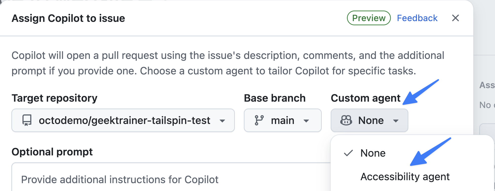

## What are custom agents?

[Custom agents][custom-agents-concept] in GitHub Copilot allow you to create specialized AI assistants tailored to specific tasks or domains within your development workflow. By defining agents through markdown files in the `.github/agents` folder of your repository, you can provide Copilot with focused instructions, best practices, coding patterns, and domain-specific knowledge that guide it to perform particular types of work more effectively. Teams can codify their expertise into reusable agents — an accessibility agent that enforces [WCAG][wcag] compliance, a security agent that follows secure coding practices, or a testing agent that maintains consistent test patterns.

Custom agents are defined by markdown files in the `.github/agents` folder of your project, or globally in `~/.copilot/agents`. Each file has YAML frontmatter with at least a `name` and `description`, followed by a markdown prompt that defines the agent's behavior, expertise, and instructions.

### Custom agents compared with agent skills

There's some logical overlap between custom agents and [agent skills][agent-skills-concept]. Both are primarily defined with markdown files and tell an AI how to perform operations. The cleanest way to separate them: a **custom agent** is the worker, and **skills** are tools.

Custom agents have their own context window and are built to orchestrate skills (and even other agents) as part of doing their work. In this lab, the accessibility custom agent reviews and updates the site against accessibility guidelines; as part of that work it could call skills such as a pull-request workflow skill or one that runs and manages tests.

> [!NOTE]
> There's no single "right" way to author a custom agent. As with anything in AI, test and iterate to find what works for your environments and scenarios.

[custom-agents-concept]: https://docs.github.com/copilot/concepts/agents/cloud-agent/about-custom-agents
[agent-skills-concept]: https://docs.github.com/copilot/concepts/agents/about-agent-skills
[wcag]: https://www.w3.org/WAI/standards-guidelines/wcag/
You'll explore the following with custom agents:

- how custom agents are defined.
- assigning a task to a custom agent.

## Scenario

Tailspin Toys is committed to ensuring their crowdfunding platform is accessible to all users, regardless of their visual abilities or preferences. Recent user feedback has highlighted that some users find the current dark theme difficult to read due to insufficient contrast between text and background colors. To address this accessibility concern, the design team has requested the implementation of a high-contrast mode that users can toggle on and off.

Because accessibility is critical, you want to ensure this is implemented as quickly as possible. You're going to utilize a custom agent to generate the functionality.
## Reviewing the accessibility custom agent

A custom agent has already been created for you for accessibility. Let's review the contents to understand how it will guide Copilot.

Return to your codespace, then review the accessibility custom agent file:

1. Open `.github/agents/accessibility.md`.
2. Note the YAML frontmatter with the `name` and `description` fields.

> [!CAUTION]
> The frontmatter with `name` and `description` is required for custom agents.

3. From there, scan and review the next sections which highlight:
   - Core responsibilities when generating code for an accessible website.
   - Best practices for accessibility.
   - Code examples for HTML, CSS, and JavaScript.
   - A list of common pitfalls and mistakes.
## Create and assign an issue

Mission control is the central location for working with all agents for your environment. You can assign tasks to Copilot cloud agent, monitor tasks, and even redirect and provide additional guidance. Let's start by assigning a task to create the high contrast mode to Copilot.

1. Navigate to your repository.
2. Select the issues tab.
3. Select **New issue** to open the new issue dialog.
4. Select **Blank issue** to create the new issue.
5. Set the **Title** to `Add high contrast mode to website`.
6. Set the **Description** to:

    ```plaintext
    We need a high contrast mode for the site. There should be a toggle for high contrast which the user can set. It should store the setting in local storage on the browser.
    ```

7. Select **Create** to create the issue.
8. On the right side, select **Assign to Copilot** to open the assignment dialog.
9. Select **Accessibility agent** from the list of custom agents.

    

10. Select **Assign**.
11. Copilot gets to work on the task in the background!

## Summary and next steps

This lesson explored [custom agents][custom-agents] in GitHub Copilot, specialized AI assistants tailored to specific tasks and domains. With custom agents you can codify your team's expertise and standards into reusable agents that guide Copilot to perform particular types of work more effectively.

You explored these concepts:

- how custom agents are defined.
- assigning a task to a custom agent.

With Copilot working on implementing the high contrast mode, we can now turn our attention to [monitoring and steering the agent session][next-lesson] from mission control.

## Resources

- [About custom agents][custom-agents]
- [Preparing to use custom agents in your organization][org-custom-agents]
- [Preparing to use custom agents in your enterprise][enterprise-custom-agents]

---

| [← Previous lesson: GitHub Copilot cloud agent][previous-lesson] | [Next lesson: Monitoring and managing agents →][next-lesson] |
|:--|--:|

[previous-lesson]: ../2-cloud-agent/
[next-lesson]: ../4-managing-agents/
[custom-agents]: https://docs.github.com/copilot/concepts/agents/cloud-agent/about-custom-agents
[org-custom-agents]: https://docs.github.com/copilot/how-tos/administer-copilot/manage-for-organization/prepare-for-custom-agents
[enterprise-custom-agents]: https://docs.github.com/copilot/how-tos/administer-copilot/manage-for-enterprise/manage-agents/prepare-for-custom-agents
