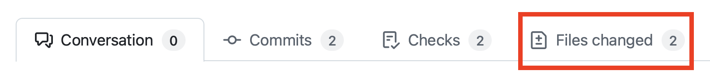
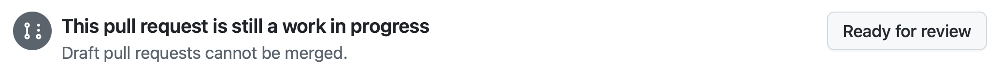

| [← Previous lesson: Managing agents][previous-lesson] |
|:--|

## Reviewing the work

Throughout this lab you've worked with GitHub Copilot on several tasks focused on improving the user experience and adding functionality. You asked Copilot to add documentation to your code, build a related games feature for the design team to iterate on, and implement accessibility features including high-contrast and light mode toggles. Let's explore the code changes and, if necessary, provide feedback to Copilot to improve its work.

### Scenario

As has been highlighted numerous times, the fundamentals of software design and DevOps do not change with the addition of generative AI. We always want to review the code generated, and work through our normal DevOps process. With that in mind, let's review the suggestions from GitHub Copilot for creating the documentation, the related games feature, and accessibility features before we turn on review for the rest of our team.
## Security and GitHub Copilot cloud agent

Because Copilot cloud agent performs its tasks asynchronously and without supervision, certain security constraints have been put in place to ensure everything remains safe. These include:

- Copilot only has read access to your repository and write access **only** to the branch it will use for its code.
- Cloud agent runs inside of GitHub Actions, where it will create a separate, ephemeral environment in which to work.
- Any GitHub Actions workflows require approval from a human before they can be run.
- [Access to external resources is limited by default](https://docs.github.com/copilot/how-tos/copilot-on-github/customize-copilot/customize-cloud-agent/customize-the-agent-firewall), including MCP servers.
## Reviewing the generated documentation

Let's start by exploring the first pull request (PR) generated by GitHub Copilot cloud agent - adding documentation to your code. You'll perform this task by utilizing the standard PR interface in GitHub.com.

> [!NOTE]
> When you explore the PR you may notice a warning about GitHub Copilot being blocked by a firewall. This **is expected**, as Copilot has limited access to external resources by default, including calls to external MCP servers. If you wish, you can [customize or disable the firewall for Copilot cloud agent][agent-firewall].

1. Return to your repository on github.com.
2. Select **Pull Requests** to open the list of pull requests.
3. Open the pull request titled something similar to **Add missing documentation** or something more robust.

> [!NOTE]
> If Copilot is still working on the task, the pull request will contain the **[WIP]** flag. If so, wait for Copilot to complete the work. This may take a few minutes, so feel free to take a break, or reflect on everything you've learned so far.

4. Once the pull request is ready, select the **Files changed** tab and review the changes.

    

5. Explore the newly updated code, which includes the newly created TSDoc doc comments and other documentation. The exact changes will vary.

    As you scan the changes, look for TSDoc doc comments, TypeScript conventions, and comment headers. These come from the custom instruction files you reviewed at the start of Exercise 2.

6. Once you've reviewed the updates and everything looks good, navigate back to the **Conversation** tab and scroll down.
7. You should see an indicator that some workflows are waiting for approval.
8. If workflows are waiting for approval, select **Approve and run workflows**.

   
9. You should see the workflows get queued in the checks section of the pull request. All being well, you should see that the project checks pass for the single Astro app. This may take a few minutes to complete.

## Requesting changes from GitHub Copilot

Working with Copilot on a pull request is not just a one-way street. You can also tag Copilot in comments - like you would other members of your team - in the pull request, or inline comments of the code. Copilot will see these comments, and trigger another session to address them. Due to the non-deterministic results, we can't give prescriptive text of what to ask for. Some ideas of what to ask Copilot to update include:

- Add comment headers to the top of each code file with a brief description of what they do.
- Add TSDoc doc comments to TypeScript and Astro files.
- Create a README with a description of the Astro app structure.

1. Add a comment requesting a change to the generated documentation, tagging **@copilot** like you would any user. Use one of the ideas above, or another suggestion for Copilot around documentation you'd like to see in the codebase.
2. Select **View Session** to watch Copilot perform its work. Notice how Copilot starts a new session to make the updates.
3. You can select **Back to pull request** to return to the pull request.

    

4. Once Copilot has completed the changes, you should see a new commit in the pull request.
5. Select the **Files changed** tab to review the changes.

Feel free to continue iterating until you are happy. Once happy, you can convert the PR to ready from a draft, and merge it into the main branch.



## Review the related games feature

Let's return to the PR Copilot generated for resolving our issue about showing related games on the game details page.

1. Return to your repository in GitHub.com.
2. Select the **Pull Requests** tab.
3. Select the PR which has a title similar to **Show related games on the game details page** or something more robust.
4. Select the **Files changed** tab to review the code it generated.
5. Once you've reviewed the updates and everything looks good, navigate back to the **Conversation** tab and scroll down.
6. You should see an indicator that some workflows are waiting for approval.
7. If workflows are waiting for approval, select **Approve and run workflows**.

   
8. You should see the workflows get queued in the checks section of the pull request. All being well, you should see that the project checks pass for the single Astro app. This may take a few minutes to complete.
9. **Optional:** You could even switch to this branch in your Codespace to perform a manual test of the related games feature. Navigate to your Codespace, open the terminal, and run the following commands (replace `<branch-name>` with the name of the branch Copilot created, e.g. **copilot/fix-8**.):

    ```bash
    git fetch origin
    git checkout <branch-name>
    ```
   
Copilot has built the related games feature! Just as before, you can work iteratively with Copilot cloud agent to request updates. For example, you might want to request Copilot tweak how many related games are shown, or ensuring comment headers and TSDoc doc comments are added (remember - this was assigned **before** you made the updates to your custom instructions!) Just like before, you can make these requests by adding a new comment on the **Conversation** tab, which Copilot will see and kickoff a new session.

## Review the accessibility features

Finally, let's review the accessibility features that were implemented using the custom accessibility agent. This PR should include both the high-contrast mode you assigned in Exercise 3, and the light mode that was requested in mission control in Exercise 4.

1. Return to your repository in GitHub.com.
2. Select the **Pull Requests** tab.
3. Select the PR which has a title similar to **Add high contrast mode to website** or something more robust.

> [!NOTE]
> If Copilot is still working on the task, the pull request will contain the **[WIP]** flag. If so, wait for Copilot to complete the work. This may take a few minutes.

4. Select the **Files changed** tab to review the code it generated.
5. Review the implementation, paying particular attention to:
   - The toggle UI components for switching between modes
   - The use of local storage to persist user preferences
   - The CSS or styling changes for high-contrast and light modes
   - The accessibility attributes (ARIA labels, keyboard navigation, etc.)
   - Any JavaScript/TypeScript code that manages the mode switching

6. Once you've reviewed the updates and everything looks good, navigate back to the **Conversation** tab and scroll down.
7. You should see an indicator that some workflows are waiting for approval.
8. If workflows are waiting for approval, select **Approve and run workflows**.

   
9. You should see the workflows get queued in the checks section of the pull request. All being well, you should see that the project checks pass for the single Astro app. This may take a few minutes to complete.
10. **Optional:** You could switch to this branch in your Codespace to manually test the accessibility features. Navigate to your Codespace, open the terminal, and run the following commands (replace `<branch-name>` with the name of the branch Copilot created):

    ```bash
    git fetch origin
    git checkout <branch-name>
    ```

    Then start the application and test the high-contrast and light mode toggles in your browser to ensure they work as expected and persist across page reloads.

Notice how the custom accessibility agent helped guide Copilot to implement these features following accessibility best practices. If you see any accessibility concerns or improvements, you can tag **@copilot** in a comment to request updates, just like you did with the previous PRs.

## Optional exercise — keep delegating

Cloud agent works best when you can hand it real backlog items and turn your attention elsewhere. To build the habit, file a few more issues against your repository and assign them to Copilot. Some ideas:

- Create a backer interest form on the game details page.
- Implement pagination on the game list page.
- Add input validation and error handling to the data-access helpers.

## Summary

You completed the Cloud agent harness. Across these lessons you:

- **Inspected the custom instruction files this repo ships with** so you could see their effect in cloud agent's output later.
- **Assigned issues to Copilot cloud agent** and watched it set up its environment, plan, and execute asynchronously.
- **Created and used a custom agent** for accessibility, adding high-contrast and light-mode toggles.
- **Used the Copilot agents page as mission control** to monitor and steer the accessibility session mid-flight.
- **Reviewed and iterated on cloud agent's pull requests**, tagging `@copilot` to request changes and approving workflows.

## Review and next steps

You've completed the Cloud agent harness. If you'd like to keep exploring, the other harnesses complement what you practiced here:

- 🖥️ **[VS Code harness](../../vscode/)** — explore Copilot Chat agent mode and MCP integration directly from your IDE.
- 💻 **[CLI harness](../../cli/)** — work the same flows from your terminal with Copilot CLI: plan mode, agent skills, custom agents, and slash commands like `/delegate` to bridge back to the cloud agent you used here.

In your own repository, try these follow-up ideas:

- Assign a refactoring or test-coverage issue to cloud agent.
- Create a custom agent for another domain.
- Set up `copilot-setup-steps.yml` for a different stack.

## Resources

- [GitHub Copilot][github-copilot]
- [About Copilot agents][copilot-agents]
- [Assigning GitHub issues to Copilot][assign-issue]
- [Copilot cloud agent setup workflow best practices][cloud-agent-best-practices]
- [Configuring Copilot cloud agent firewall][agent-firewall]

---

| [← Previous lesson: Managing agents][previous-lesson] |
|:--|

[github-copilot]: https://github.com/features/copilot
[cloud-agent-overview]: https://docs.github.com/copilot/concepts/agents/cloud-agent/about-cloud-agent
[assign-issue]: https://docs.github.com/copilot/how-tos/use-copilot-agents/cloud-agent/start-copilot-sessions
[setup-workflow]: https://docs.github.com/copilot/how-tos/copilot-on-github/customize-copilot/customize-cloud-agent/customize-the-agent-environment
[copilot-agents]: https://docs.github.com/copilot/concepts/agents/cloud-agent/about-cloud-agent
[cloud-agent-best-practices]: https://docs.github.com/copilot/how-tos/copilot-on-github/customize-copilot/customize-cloud-agent/customize-the-agent-environment
[agent-firewall]: https://docs.github.com/copilot/how-tos/copilot-on-github/customize-copilot/customize-cloud-agent/customize-the-agent-firewall

[previous-lesson]: ../4-managing-agents/
