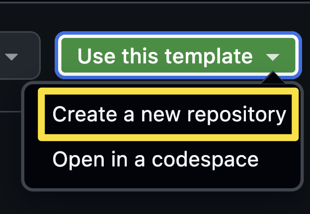
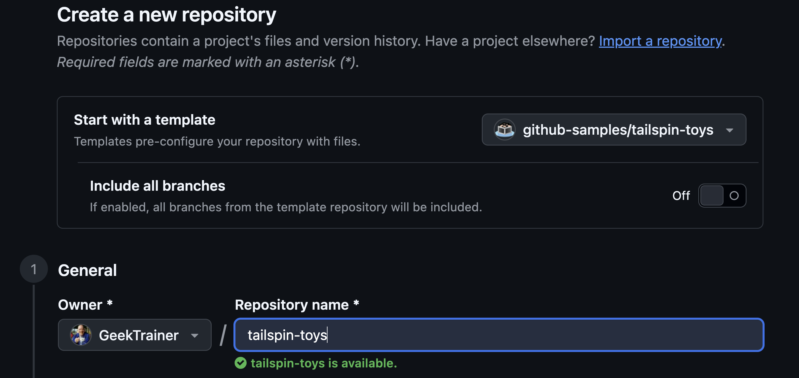

La aplicación GitHub Copilot es una aplicación de escritorio que actúa como centro de operaciones tanto para Copilot como para GitHub. Proporciona acceso rápido a incidencias y solicitudes de incorporación de cambios y, por supuesto, permite desarrollar con GitHub Copilot. Durante este taller trabajarás en local con la aplicación Tailspin Toys, creada con Astro, y con la aplicación GitHub Copilot. Antes de empezar, vamos a comprobar que Node.js esté instalado en local y, después, instalaremos la aplicación Copilot.

En esta lección:

- instalarás Node.js para poder ejecutar las pruebas del proyecto en tu equipo.
- crearás tu propia copia del proyecto Tailspin Toys a partir de la plantilla.

## Instalar Node.js

En varias lecciones se pide a un agente que desarrolle funcionalidades y ejecute en local el conjunto de pruebas de Tailspin Toys, para lo que se necesita [**Node.js**][nodejs], el único entorno de ejecución que requiere el proyecto. Instala la versión **22 o posterior**; la versión **LTS** actual es una opción segura.

La opción más sencilla en cualquier plataforma es usar el instalador oficial:

1. En el sistema operativo, abre una ventana de terminal con Windows Terminal, Terminal de macOS o la aplicación que utilices habitualmente.
2. Ejecuta el comando siguiente para confirmar que tienes instalada la versión 22 de Node.js o una posterior:

    ```shell
    node --version
    ```

3. Si aparece `v22` o un número superior, puedes pasar a la sección siguiente.

> [!TIP]
> Solo tienes que completar estos pasos si no tienes Node instalado o si necesitas actualizarlo.

4. Abre la [página de descarga de Node.js][node-download].
5. Descarga la versión **LTS** correspondiente a tu sistema operativo.
6. Ejecuta el instalador y acepta las opciones predeterminadas. En Windows, mantén seleccionada la opción **Add to PATH**.
7. Después de instalarlo, abre una nueva ventana de terminal.
8. Confirma la instalación en la nueva ventana de terminal mediante el comando siguiente:

    ```bash
    node --version
    ```

9. Debería aparecer `v22.x.x` o una versión posterior.

> [!TIP]
> ¿Prefieres usar contenedores? Si tienes [**Docker**][docker], puedes utilizar el [contenedor de desarrollo][dev-containers] del repositorio en lugar de instalar Node.js en local; el contenedor ya incluye Node. No necesitas ambas opciones.

## Configurar el repositorio del laboratorio

Trabajarás con tu propia copia del proyecto Tailspin Toys. Créala ahora a partir del [repositorio de plantilla][template-repository]. El nuevo repositorio contiene todos los archivos necesarios para el laboratorio y lo conectarás a la aplicación en la siguiente lección.

1. En una nueva ventana del navegador, ve al repositorio de GitHub de este laboratorio: `https://github.com/github-samples/tailspin-toys`.
2. Para crear tu propia copia del repositorio, selecciona el botón **Use this template** en la página del repositorio del laboratorio. A continuación, selecciona **Create a new repository**.

    

3. Si realizas el taller como parte de un evento dirigido por GitHub o Microsoft, sigue las instrucciones de los mentores. De lo contrario, puedes crear el nuevo repositorio en una organización en la que tengas acceso a GitHub Copilot.

    

4. Anota la ruta del repositorio que has creado (**organization-or-user-name/repository-name**), ya que la utilizarás más adelante en el laboratorio.

> [!NOTE]
> Al crear el repositorio a partir de la plantilla, se genera automáticamente una lista de incidencias de trabajo pendiente. Trabajarás con estas incidencias durante todo el taller; no necesitas crear ninguna.

## Resumen y pasos siguientes

Ya tienes el entorno preparado. Has instalado Node.js para poder compilar y probar el proyecto en tu equipo y has creado tu propia copia del repositorio Tailspin Toys a partir de la plantilla.

A continuación, instalarás la aplicación GitHub Copilot, conectarás el repositorio que acabas de crear y conocerás el espacio de trabajo. Continúa con la [Lección 1 - Instalar la aplicación GitHub Copilot][next-lesson].

## Recursos

- [Descargar Node.js][node-download]
- [Crear un repositorio a partir de una plantilla][template-repository]
- [Acerca de la aplicación GitHub Copilot][about-copilot-app]

[next-lesson]: ../1-install-copilot-app/
[nodejs]: https://nodejs.org/
[node-download]: https://nodejs.org/en/download
[docker]: https://www.docker.com/products/docker-desktop/
[dev-containers]: https://code.visualstudio.com/docs/devcontainers/containers
[template-repository]: https://docs.github.com/repositories/creating-and-managing-repositories/creating-a-template-repository
[about-copilot-app]: https://docs.github.com/copilot/concepts/agents/github-copilot-app