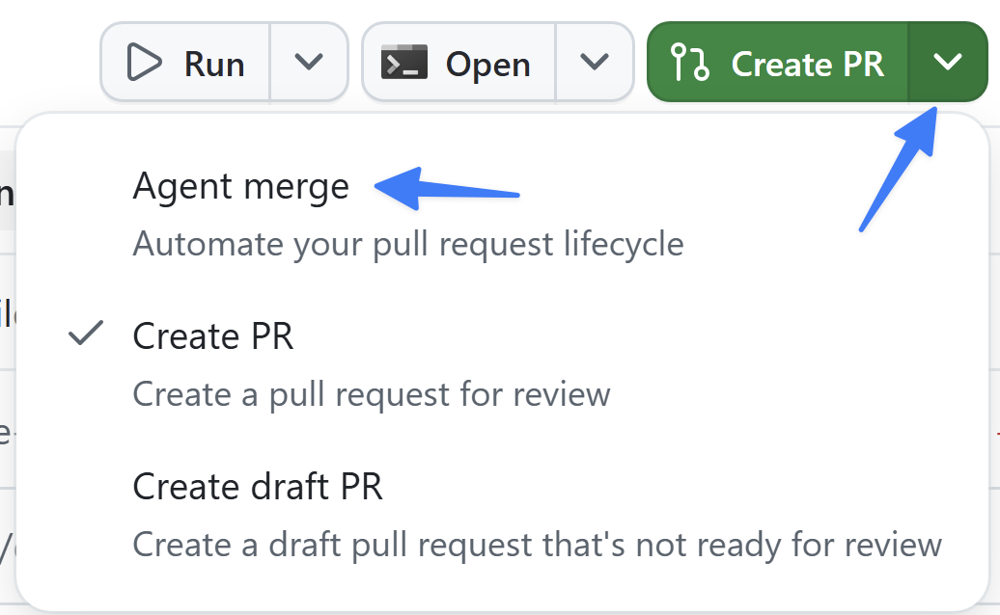
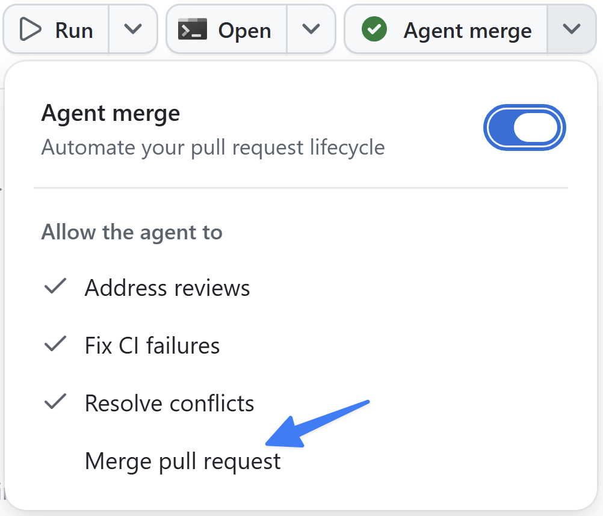

La funcionalidad de filtrado está creada, verificada y en funcionamiento en un navegador. El último paso es combinarla. Ya has combinado dos cambios en este recorrido; en ambos casos abriste la solicitud de incorporación de cambios y la combinaste personalmente en github.com. Esta vez dejarás que la aplicación se encargue del trabajo con **Agent Merge**, que guía una solicitud durante todo su ciclo de vida desde la aplicación.

En esta lección:

- aprenderás qué es Agent Merge y cómo automatiza el ciclo de vida de una combinación.
- habilitarás Agent Merge en la sesión de filtrado.
- observarás cómo crea la solicitud de incorporación de cambios, ejecuta CI y la combina cuando todo se completa correctamente.

## Escenario

En los últimos módulos has explorado distintos niveles de automatización, desde crear código hasta permitir que Copilot valide directamente una interfaz de usuario. Para acelerar aún más el desarrollo, Tailspin Toys quiere averiguar si las solicitudes de incorporación de cambios que ya se han revisado y validado pueden combinarse automáticamente.

## Introducción a Agent Merge

**Agent Merge** permite automatizar el último tramo de la incorporación de una solicitud de cambios mediante la aplicación Copilot. Al habilitarlo, la sesión de la aplicación lee la solicitud y resuelve lo que la bloquea: corrige comprobaciones de CI con errores, responde a comentarios de revisión y reorganiza la base cuando es necesario. Después la combina en cuanto GitHub lo permite. Se ejecuta en segundo plano, continúa tras reiniciar la aplicación y se desactiva cuando se combina la solicitud.

Hasta ahora, tú seleccionabas **Merge pull request** en github.com. Agent Merge transfiere esa responsabilidad al agente para que puedas pasar a la siguiente tarea mientras este guía la solicitud hasta completarla. Sigues revisando y aprobando el trabajo; el agente se ocupa del proceso mecánico final.

## Utilizar Agent Merge para gestionar la solicitud

Has revisado el código manualmente, ejecutado pruebas e incluso permitido que Copilot valide la interfaz de usuario. Ha llegado el momento de combinar el código nuevo con el código base. Vamos a permitir que Agent Merge guíe la solicitud durante la integración continua (CI) y la combine.

1. Vuelve a la sesión que mantuviste abierta en el módulo anterior mientras añadías la funcionalidad de filtrado.
2. En la esquina superior derecha, selecciona el menú desplegable situado junto a **Create PR**.
3. Selecciona **Agent merge** para habilitar Agent Merge.

   

4. El texto del botón cambia a **Agent merge**.
5. Selecciona el botón **Agent merge** para iniciar el proceso.

La aplicación Copilot comenzará a crear y gestionar la solicitud. Primero explora el proyecto para determinar la mejor forma de crearla y, después, genera la nueva solicitud.

Transcurridos unos instantes, observarás que Copilot vuelve a trabajar y examina las condiciones de la solicitud, incluido el proceso de CI que ejecuta todas las pruebas del repositorio. Comunicará el estado de las revisiones de otros miembros del equipo, las comprobaciones que deben ejecutarse y si la solicitud puede combinarse.

6. Permite que Agent Merge combine la solicitud seleccionando el menú desplegable situado junto a **Agent merge** y, después, **Merge pull request**.

   

7. Cuando todos los procesos de CI estén en verde, lo que significa que las pruebas han finalizado correctamente, Copilot combinará la solicitud.

## Resumen y pasos siguientes

Has automatizado varias partes del proceso de desarrollo, como la generación, las pruebas y la validación de código, y ahora también el proceso de solicitud de incorporación de cambios. En concreto:

- has aprendido qué es Agent Merge y cómo automatiza el ciclo de vida de una combinación.
- has habilitado Agent Merge en la sesión de filtrado.
- has observado cómo crea la solicitud de incorporación de cambios, ejecuta CI y la combina cuando todo se completa correctamente.

A continuación, explorarás los **lienzos**, una forma más completa de planificar y visualizar el trabajo con el agente. Continúa con la [Lección 7 - Planificar con lienzos][next-lesson].

## Recursos

- [Gestionar incidencias y solicitudes de incorporación de cambios con la aplicación GitHub Copilot][managing-issues-prs]
- [Acerca de la aplicación GitHub Copilot][about-copilot-app]

[next-lesson]: ../7-canvases/
[managing-issues-prs]: https://docs.github.com/copilot/how-tos/github-copilot-app/managing-issues-and-pull-requests
[about-copilot-app]: https://docs.github.com/copilot/concepts/agents/github-copilot-app