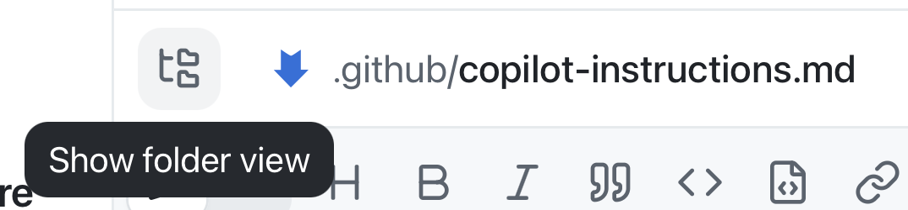

생성형 AI를 사용할 때는 컨텍스트가 중요합니다. 작업을 특정 방식으로 수행해야 하거나 Copilot이 알아야 할 배경 정보가 있다면 해당 컨텍스트를 제공해야 합니다. 가장 강력한 도구 중 하나는 원하는 코드의 *내용*뿐 아니라 코드의 *구조*도 설명하는 [지침 파일][instruction-files]입니다. 이 레슨에서는 리포지토리에 문서화 표준을 추가합니다. 이후 대부분의 작업과 마찬가지로 백로그의 이슈에서 시작하여 에이전트가 변경하도록 합니다.

이 레슨에서는 다음 작업을 수행합니다.

- 리포지토리 지침과 경로 범위 지침 파일이 에이전트에 전달되는 방식을 살펴봅니다.
- 백로그의 지침 이슈에서 세션을 시작합니다.
- 에이전트에게 `.github/copilot-instructions.md`에 문서화 표준을 추가하도록 요청합니다.
- 변경 내용을 검토하고 끌어오기 요청으로 병합합니다.

## 시나리오

모범적인 개발 조직인 Tailspin Toys에는 개발 방식에 관한 지침과 요구 사항이 있습니다. 여기에는 다음 항목이 포함됩니다.

- 코드에 TSDoc doc comments 형식의 문서를 추가해야 합니다.
- 형식을 문서화하고 린팅으로 적용해야 합니다.

지침 파일을 사용하면 Copilot이 이러한 방식에 맞게 작업을 수행하는 데 필요한 정보를 제공할 수 있습니다.

## 지침 파일

사용자 지정 지침은 Copilot에 컨텍스트와 기본 설정을 제공하여 코딩 스타일과 요구 사항을 더 잘 이해하게 합니다. 이 기능을 사용하면 Copilot이 더 관련성 높은 제안과 코드 조각을 생성하도록 안내할 수 있습니다. 선호하는 코딩 규칙과 라이브러리는 물론 코드에 포함할 주석 유형까지 지정할 수 있습니다. 리포지토리 전체에 적용되는 지침이나 작업 수준의 컨텍스트를 제공하는 특정 파일 유형용 지침을 만들 수 있습니다.

지침 파일에는 두 가지 유형이 있습니다.

- `.github/copilot-instructions.md`는 리포지토리의 **모든** 요청에서 Copilot에 전달되는 단일 지침 파일입니다. 이 파일에는 Copilot에 보내는 대부분의 채팅 또는 CLI 요청과 관련된 프로젝트 수준 정보를 포함해야 합니다. 사용 중인 기술 스택, 구축 중인 항목의 개요, 모범 사례, 기타 전역 지침을 포함할 수 있습니다.
- 특정 작업이나 파일 유형에 맞게 `.github/instructions/*.instructions.md` 파일을 만들 수 있습니다. TypeScript 또는 Astro 같은 특정 언어나 UI 구성 요소 또는 새 단위 테스트 집합 만들기와 같은 작업에 관한 지침을 제공할 수 있습니다.

> [!NOTE]
> Copilot은 AGENTS.md, CLAUDE.md, GEMINI.md를 통해 지침을 가져오는 다른 표준도 지원하므로 항상 올바른 컨텍스트를 제공할 수 있습니다.

### 지침 파일 관리 모범 사례

지침 파일 만들기를 모두 다루는 것은 이 워크숍의 범위를 벗어납니다. 하지만 샘플 프로젝트의 예제는 대표적인 접근 방식을 보여 줍니다. 개괄적인 지침은 다음과 같습니다.

- `copilot-instructions.md`의 지침은 구축 중인 항목의 설명, 프로젝트 구조, 전역 코딩 표준 등 프로젝트 수준의 안내에 집중합니다.
- `*.instructions.md` 파일을 사용하여 파일 유형(단위 테스트, Astro 구성 요소, 데이터 계층) 또는 특정 작업에 관한 구체적인 지침을 제공합니다.
- 자연어를 사용하고 지침을 명확하게 유지합니다. 코드가 따라야 하는 예와 피해야 하는 예를 제공합니다.

AI를 사용하는 방식이 하나로 정해져 있지 않듯 지침 파일을 만드는 방식도 하나로 정해져 있지 않습니다. 실험을 통해 프로젝트에 가장 적합한 방법을 찾을 수 있습니다.

> [!TIP]
> GitHub Copilot을 사용하는 모든 프로젝트에는 충실한 지침 파일 모음이 있어야 합니다. 이 프로젝트의 파일을 살펴보면 여러 코드 파일 유형을 위한 지침 파일이 있다는 것을 알 수 있습니다.
>
> 템플릿이나 시작점을 찾고 있습니까? 지침 파일, 사용자 지정 에이전트, 기타 리소스가 가득한 리포지토리인 [awesome-copilot][awesome-copilot]을 살펴봅니다.

## 프로젝트의 사용자 지정 지침 파일 살펴보기

이 리포지토리와 함께 제공되는 지침 파일을 읽어 봅니다. 핵심 `copilot-instructions.md` 하나와 여러 작업을 위한 `*.instructions.md` 파일 모음이 있습니다. 편집기 또는 GitHub 웹 UI에서 파일을 엽니다.

1. 검토 패널이 표시되지 않으면 오른쪽 위의 **Toggle review panel**을 선택하여 엽니다.

   

2. 검토 패널에 새 항목을 추가하려면 **+**를 선택합니다.
3. **File**을 선택합니다.
4. `copilot-instructions.md`를 검색합니다.
5. 파일 목록에서 `copilot-instructions.md`를 선택하여 엽니다.
6. 파일을 살펴봅니다. 프로젝트에 관한 간단한 설명과 **Agent notes**, **Code standards**, **Scripts**, **Repository Structure** 같은 섹션을 확인합니다. **Code standards** 아래에서 중첩된 **GitHub Actions Workflows** 지침을 확인합니다. 이 내용은 Copilot과의 모든 상호 작용에 적용됩니다.
7. 폴더 탐색기를 열려면 **Show folder view**를 선택합니다.

   

8. `.github/instructions` 폴더로 이동하여 파일을 살펴봅니다. Astro 파일, Drizzle 데이터 계층, 테스트 등에 관한 지침이 있습니다.
9. `.github/instructions/unit-tests.instructions.md`를 엽니다. 위쪽의 `applyTo` 필드는 지침이 적용되는 파일을 결정하는 glob을 리포지토리 루트 기준으로 설정합니다. 여기서는 TypeScript 테스트 파일(예: `**/*.test.ts`와 일치하는 파일)이 모두 일치합니다.
10. 이 프로젝트의 단위 테스트 작성에 관한 구체적인 지침을 확인합니다.
11. 마지막으로 `.github/instructions/drizzle.instructions.md`를 열고 아래쪽으로 스크롤합니다. 다른 지침 파일(예: `unit-tests.instructions.md`)과 프로젝트의 기존 파일로 연결되는 링크를 확인합니다. 이를 통해 큰 지침 집합을 더 작고 재사용 가능한 파일로 나누고 Copilot이 코드를 생성할 때 따를 예제를 지정할 수 있습니다. 이 경로는 리포지토리 루트가 아니라 지침 파일을 기준으로 합니다.

> [!NOTE]
> `copilot-instructions.md`의 **Code formatting requirements** 섹션에는 프로젝트의 코딩 표준이 있지만 아직 코드 내 문서는 요구하지 않습니다. 다음 단계에서 TSDoc doc comments와 파일 주석 헤더에 관한 규칙을 추가합니다.

## 지침 이슈에서 시작

이전 레슨에서는 직접 프롬프트로 세션을 시작했습니다. 하지만 대부분의 작업은 이슈에서 시작합니다. 지침 파일 업데이트를 위해 등록된 이슈를 바탕으로 새 세션을 만들고 업데이트를 요청합니다.

> [!NOTE]
> 지침 파일은 Copilot이 생성하는 코드에 큰 영향을 주므로 Copilot을 명확하게 안내하는지 주의 깊게 확인해야 합니다. 이 레슨처럼 Copilot으로 초안을 만든 다음 요구 사항을 충족하는지 직접 검토하는 방법이 좋습니다.

1. 사이드바에서 **My work**를 선택합니다.
2. **Update our repository coding standards** 이슈를 선택하여 엽니다.
3. 오른쪽 위의 **New session**을 선택하여 이슈를 바탕으로 새 세션을 시작합니다.

   

4. 다음 프롬프트를 사용하여 이슈에 문서화된 요구 사항에 맞게 지침 파일을 업데이트하도록 Copilot에 요청합니다.

  ```plaintext
  Following this issue, make the updates to the instructions files in this project to meet the requirements documented. Don't create the PR quite yet!
  ```

Copilot이 업데이트를 적용합니다.

## 변경 내용 검토

Copilot이 적용한 업데이트를 읽고, 업데이트된 지침을 바탕으로 앞으로 생성할 코드의 예제도 요청합니다.

1. 오른쪽 위의 **Changes**를 선택하여 코드 변경 내용을 엽니다.

   

2. 업데이트된 지침 파일을 검토합니다. 코드에 문서와 주석을 추가하는 지침이 있는지 확인합니다.

> [!NOTE]
> AI는 결정론적이 아니라 확률적으로 작동하므로 정확한 텍스트는 달라질 수 있습니다.

3. 다음 프롬프트를 사용하여 앞으로 생성할 코드의 예제를 만들도록 Copilot에 요청합니다.

  ```plaintext
  Do not make any updates, but show me what the code would look like. Based on the new instructions, if I asked Copilot to create a new library component to return all Publishers what would that code look like?
  ```

4. Copilot이 제안한 코드를 검토합니다. 업데이트된 지침에서 요구한 대로 TSDoc doc comments와 파일 헤더 주석이 포함되어 있는지 확인합니다.

이제 프로젝트의 지침 파일을 업데이트하고 그 영향을 확인했습니다.

## 끌어오기 요청 열기 및 병합

지침 파일은 리포지토리 자산이므로 팀의 다른 구성원과 공유됩니다. 다른 자산과 마찬가지로 작업 내용이 포함된 PR을 만듭니다.

1. 오른쪽 위에서 **Create PR**을 선택합니다.
2. 메시지가 표시되면 **Sign in with your browser**를 선택하고 안내에 따라 인증합니다.
3. Copilot이 PR을 만들기 시작합니다.

PR이 만들어지면 Copilot은 리포지토리에서 실행해야 하는 워크플로를 모니터링합니다. 잠시 후 오른쪽 위의 버튼이 **Ready to merge**로 바뀝니다. 이는 PR을 병합할 준비가 되었다는 표시입니다.

4. **Ready to merge**를 선택합니다.
5. 새 대화 상자에서 **Merge pull request**를 선택하여 끌어오기 요청을 병합합니다.

> [!NOTE]
> 표준을 기본 브랜치에 병합하면 모든 사용자와 새 세션에서 프로젝트의 일부로 사용됩니다. 다음 레슨에서 최신 기본 브랜치로 필터링 세션을 시작하면 에이전트가 이 표준을 자동으로 따릅니다. 요청하지 않아도 생성된 TypeScript에 TSDoc doc comments가 포함되는 것을 통해 지침이 생성 코드에 미치는 작지만 실제적인 영향을 확인할 수 있습니다.

## 요약 및 다음 단계

앱이 지침 파일에서 컨텍스트를 가져오는 방식을 살펴본 다음 세션을 사용하여 리포지토리 전체에 적용되는 표준을 추가하고 병합했습니다. 구체적으로 다음 작업을 수행했습니다.

- 리포지토리의 `copilot-instructions.md`와 경로 범위 `*.instructions.md` 파일을 살펴봤습니다.
- 백로그의 지침 이슈에서 세션을 시작했습니다.
- 에이전트에게 `.github/copilot-instructions.md`에 문서화 표준을 추가하도록 요청했습니다.
- 변경 내용을 검토하고 끌어오기 요청으로 병합했습니다.

다음으로 새 세션에서 필터링 기능을 구축하고 방금 병합한 표준이 자동으로 적용되는지 확인합니다. [레슨 4 - Autopilot으로 기능 구축][next-lesson]을 계속 진행합니다.

## 리소스

- [GitHub Copilot 사용자 지정을 위한 지침 파일][instruction-files]
- [GitHub Copilot app 사용자 지정][customize-app]
- [사용자 지정 지침 만들기 모범 사례][instructions-best-practices]
- [Awesome Copilot — 지침 파일 및 기타 리소스 모음][awesome-copilot]

[next-lesson]: ../4-build-filtering/
[instruction-files]: https://docs.github.com/copilot/customizing-copilot/about-customizing-github-copilot-chat-responses
[customize-app]: https://docs.github.com/copilot/how-tos/github-copilot-app/customize-github-copilot-app
[instructions-best-practices]: https://docs.github.com/enterprise-cloud@latest/copilot/using-github-copilot/coding-agent/best-practices-for-using-copilot-to-work-on-tasks#adding-custom-instructions-to-your-repository
[awesome-copilot]: https://awesome-copilot.github.com/
[custom-instructions-support]: https://docs.github.com/copilot/reference/custom-instructions-support
[ui-instructions]: https://github.com/github-samples/tailspin-toys/blob/main/.github/instructions/ui.instructions.md
[astro-instructions]: https://github.com/github-samples/tailspin-toys/blob/main/.github/instructions/astro.instructions.md
[managing-issues-prs]: https://docs.github.com/copilot/how-tos/github-copilot-app/managing-issues-and-pull-requests