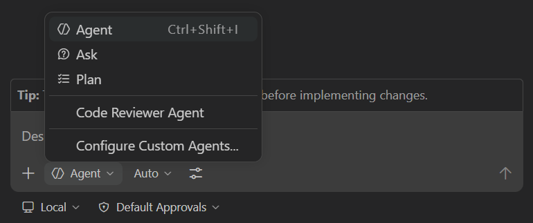
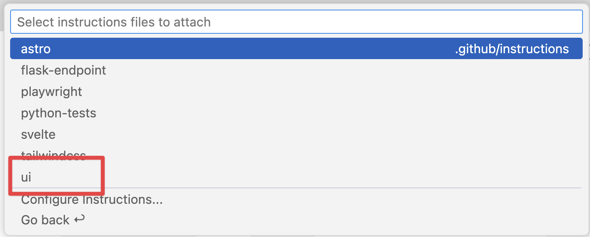
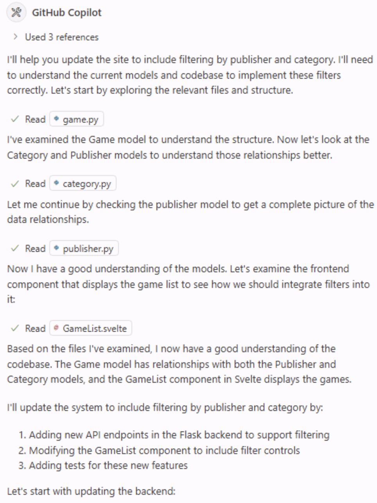
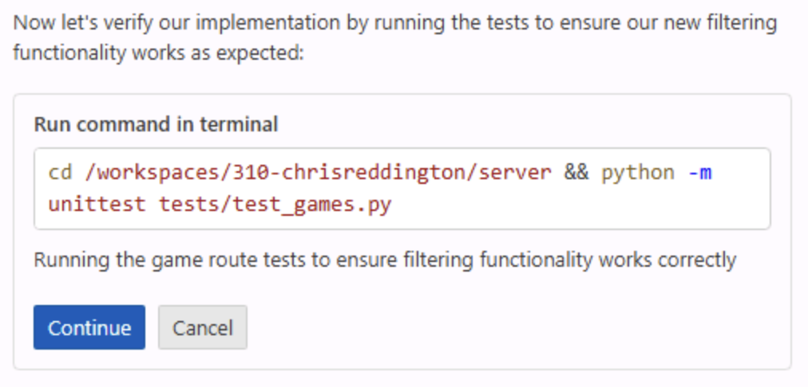
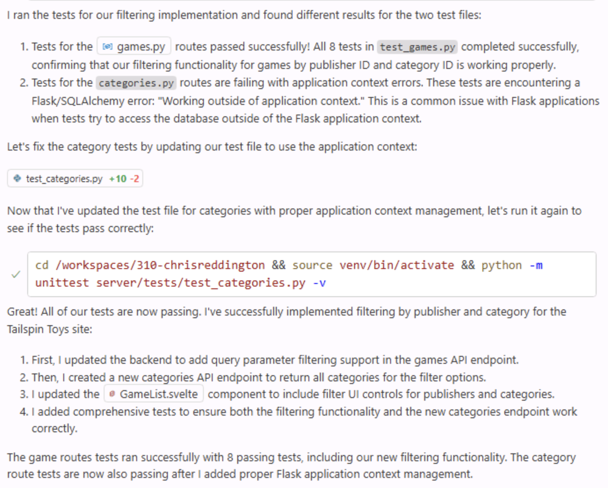

Even the simplest of updates to an application typically require updates to multiple files and operations to be performed like running tests. As a developer your flow typically involves tracking down all the necessary files, making the changes, running the tests, debugging, figuring out which file was missed, making another update... The list goes on and on.

This is where Copilot Agent Mode comes into play.

Copilot Agent Mode is built to act more autonomously in your IDE. It behaves in a similar fashion to a developer, starting by exploring the existing project structure, performing the necessary updates, running tasks like tests, and automatically fixing any discovered mistakes. Let's explore how you can use Agent Mode to introduce new functionality to your site.

> [!NOTE]
> While the names are similar, agent mode and cloud agent are built for two different types of experiences. Agent mode performs its tasks in your IDE, allowing for quick feedback cycles and interaction. Cloud agent is designed as a peer programmer, working asynchronously like a member of the team, interacting with you via issues and pull requests.

In this exercise, you will learn how:

- Copilot Agent Mode can explore your project, identify relevant files, and make coordinated changes.
- GitHub Copilot Agent Mode can implement new features across the UI and data layer.
- to review changes and tests generated by Copilot Agent Mode before merging into your codebase.

## Scenario

As the list of games grows, you want to allow users to filter by category and publisher. You already added a publishers helper in the previous exercise, and now you'll finish the remaining data-layer, UI, and test work with Copilot Agent Mode.

## Running the Tailspin Toys website

Before you make any changes, let's explore the Tailspin Toys website to understand its current functionality.

The website is a crowdfunding platform for board games with a developer theme. It allows users to list games and display details about them. The website is a single Astro app that renders its pages as static HTML at build time. Pages query a local SQLite database directly in their frontmatter through Drizzle ORM — there's no separate backend API or client-side UI framework. Reusable data-access helpers live in `src/lib/`, and any interactivity is added with a small, scoped Astro `<script>` using standard DOM APIs.

### Starting the website

To make running the website easier, an `npm run dev` task has been provided that starts the single Astro dev server. You can run it in your GitHub Codespace with the following steps:

1. Return to your codespace. You should be back on `main` after the previous exercise.
2. Open a new terminal window inside your codespace by selecting <kbd>Ctrl</kbd> + <kbd>\`</kbd>.
3. Create and switch to a new branch for this filtering work:

   ```bash
   git checkout main
   git pull
   git checkout -b filtering-vscode
   ```

4. Run the following command to start the website:

   ```bash
   npm run dev
   ```

   Once the Astro dev server is ready, you should see a banner indicating the URL, similar to the below:

   ```bash
   🚀 Tailspin Toys is ready!
      Astro server: http://localhost:4321
      Press Ctrl-C to stop.
   ```

> [!NOTE]
> If a dialog box opens prompting you to open a browser window for `http://localhost:4321` close it by selecting the **x**.

5. Open the website by holding <kbd>Command</kbd> (Mac) or <kbd>Ctrl</kbd> (Windows/Linux) and selecting the Astro server address `http://localhost:4321` in the terminal.

> [!NOTE]
> When using a codespace, selecting a link for the localhost URL from the Codespace terminal will automatically redirect you to `https://<your-codespace-name>-4321.app.github.dev/`. This is a private tunnel to your codespace, which is now hosting your web server!

### Exploring the website

Once the website is running, you can explore its functionality. The main features of the website include:

- **Home Page**: Displays a list of board games with their titles, images, and descriptions.
- **Game Details Page**: When you select a game, you'll be brought to a details page with more information about the game, including its title, description, publisher and category.

## Explore the backlog with Copilot

> [!TIP]
> **Open Copilot Chat**
>
> Before you start the exercises below, return to your codespace, open the Copilot Chat panel, and select **New Chat** to start a clean conversation. Mode and model selection vary per exercise — each step calls those out where it matters.
The initial implementation of the website is functional, but we want to enhance it by adding new capabilities. Let's start off by reviewing the backlog. When you set up your project from the template, a backlog of issues was created for you automatically — ask GitHub Copilot to show you those items.

1. Select **Agent** from the agents dropdown in the Chat view. The **Agent** agent autonomously plans and implements changes across files, runs terminal commands, and invokes tools.

   

2. Select **Claude Sonnet 4.5** from the list of available models.

> [!CAUTION]
> The authors of this workshop are not indicating a preference towards one model or another. When building this workshop, we used Claude Sonnet 4.5, and as such are including that in the instructions. The hope is the code suggestions you receive will be relatively consistent to ensure a good experience. However, because LLMs are probabilistic, you may notice the suggestions received differ from what is indicated in the workshop. This is perfectly normal and expected.

> [!NOTE]
> Because of the probabilistic nature of LLMs, Copilot may utilize a different MCP command, but should still be able to complete the task.

3. Ask Copilot about the backlog of issues by sending the following prompt to Copilot:

   ```plaintext
   Please show me the backlog of items from my GitHub repository. Help me prioritize them based on those which will be most useful to the user.
   ```
4. Select **Continue** to run the command to list all issues.
5. Review the generated list of issues.

Notice how Copilot has even prioritized the items for you, based on the ones that it thinks will be most useful to the user.

## Review instructions files

Before kicking off the agent to generate the code, it's a good time to review the instructions file you'll use to provide Copilot context for its work. You're going to take advantage of the [user interface (UI)](https://github.com/github-samples/tailspin-toys/blob/main/.github/instructions/ui.instructions.md) file, which contains context on how to approach adding functionality to the website.

1. In your codespace, navigate to `.github/instructions/ui.instructions.md`.
2. Take note of the overall guidance on how to approach adding functionality. This includes:
   - An overview of the architecture.
   - Principles for component design, testability and accessibility.
   - Links to specific instructions files for various file types, including:
     - Astro
     - Tailwind CSS
     - Drizzle

> [!TIP]
> Instructions files allow you to reference both other instructions files and files in your project. The paths are relative to the location of the instructions file. This allows for reuse, breaking down complex instructions into smaller more manageable chunks, and providing examples and templates.

## Implement the filtering functionality

To complete filtering, no less than three separate updates will need to be made to the application:

- Add or refine the remaining filtering logic in the data layer (`src/lib/`)
- Add or update tests for filtering behavior
- Update the games listing page to introduce the filtering UI

In addition, the tests need to run (and pass) before you merge everything into your codebase. Copilot Agent Mode can perform these tasks for you! Let's add the functionality.

1. You can continue in the current conversation with Copilot, or start a new one by selecting **New Chat**.
2. Select **Add Context**, **Instructions**, and **ui** as the instructions file.

   

3. Ensure **Agent** is still selected from the agents dropdown in the Chat view.

   

4. Ensure **Claude Sonnet 4.5** is still selected for the model.
5. Prompt Copilot to implement the functionality based on the related issue in your backlog by using the following prompt:

   ```plaintext
   Please update the site to include filtering by publisher and category based on the requirements from the related GitHub issue in the backlog. A publishers helper already exists from the previous exercise, so preserve and refine that work as needed while completing the remaining data-layer, UI, and tests. Ensure all tests are passing before completion. The server is already running, so you do not need to start it up.
   ```

6. Watch as Copilot begins by exploring the project, locating the files associated with the desired functionality. You should see it finding both the data-layer helpers and UI, as well as the tests. It then begins modifying the files and running the tests.

   

> [!NOTE]
> You will notice that Copilot will perform several tasks, like exploring the project, modifying files, and running tests. It may take a few minutes depending on the complexity of the task and the codebase. During that process, you may notice **Keep** and **Undo**  buttons appear in the code editor. When Copilot is finished, you will have a **Keep** or **Undo** for all of the changes, so you do not need to select them while work is in progress.

7. As prompted by Copilot, select **Continue** to run the tests.

   

8. You may experience some pauses and even see some tests fail throughout the process. That's okay! Copilot works back and forth between code generation and tests until it completes the task and doesn't detect any errors.

   

9. Explore the generated code for any potential issues.

> [!CAUTION]
> Remember, it's always important to review the code that Copilot or any AI tools  generate.

10. Return to the browser with the website running. Explore the new functionality!
11. Once you've confirmed everything works and reviewed the code, select **Keep** in the Copilot Chat window.

## Summary and next steps

Congratulations! In this exercise, we explored how to use GitHub Copilot Agent Mode to add new capabilities to the Tailspin Toys website. We learned how:

- GitHub Copilot Agent Mode can implement new features across the UI and data layer.
- Copilot Agent Mode can explore your project, identify relevant files, and make coordinated changes.
- to review changes and tests generated by Copilot Agent Mode before merging into your codebase.

Now let's [test your feature with the Playwright MCP server][next-lesson] and open a pull request for it.

### Bonus exploration exercise – Implement paging

As the list of games grows there will be a need for paging to be enabled. Using the skills you learned in this exercise, prompt Copilot to update the site to implement paging. Some considerations for the code include:

- follow the existing best practices, including using the existing instructions files.
- consider how you want paging implemented, if you want to allow the user to select the page size or for it to be hard-coded.
- as you create the prompt ensure you provide Copilot with the necessary guidance to create the implementation as you desire.
- you may need to iterate with GitHub Copilot, asking for changes and providing context. This is the normal flow when working with Copilot!

## Resources

- [Copilot ask, edit, and agent modes: What they do and when to use them][choose-mode]
- [Agent mode in VS Code][vs-code-agent-mode]

[previous-lesson]: ../1-custom-instructions/
[next-lesson]: ../3-mcp/
[choose-mode]: https://github.blog/ai-and-ml/github-copilot/copilot-ask-edit-and-agent-modes-what-they-do-and-when-to-use-them/
[vs-code-agent-mode]: https://code.visualstudio.com/docs/copilot/chat/chat-agent-mode
